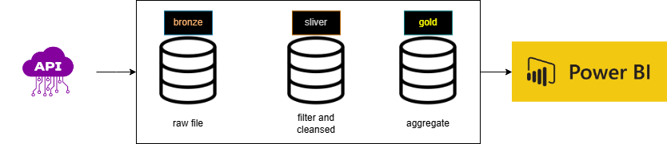

# 🐉 simple-pipelines-databricks

### A fun and simple demo for building modular data pipelines using Apache Spark on Databricks.

The main goal of this project is to **use Databricks tools to make data pipelines as simple as possible**.  
I chose a lightweight and fun API – [Dragon Ball API](https://web.dragonball-api.com/) – just because I like Dragon Ball!  
It’s perfect for demonstrating pipeline concepts without needing a complex dataset.

---

## 📌 Project Workflow Overview

Below is the high-level design of the pipeline:

---

## 🛠️ Step-by-Step Setup

### 1. Create a Resource Group

### 2. Create a Databricks Workspace  

### 3. Create a Storage Account  
  

---

## 📒 Notebooks

The pipeline follows the **medallion architecture** pattern:

- **Bronze** – Raw data ingestion from the API  
- **Silver** – Cleaned and transformed data  
- **Gold** – Final curated data ready for reporting or downstream use

Each layer has its own notebook to keep things simple and modular.

---

## ⚙️ Create a Workflow

Use **Databricks Workflows** to orchestrate your pipeline end to end:

